# Browse Recipes Feature - Complete Documentation

## 📋 Table of Contents
1. [Overview](#overview)
2. [Architecture Diagram](#architecture-diagram)
3. [Features](#features)
   - [Recipe Discovery Sections](#1-recipe-discovery-sections)
   - [Advanced Filtering System](#2-advanced-filtering-system)
   - [Search Functionality](#3-search-functionality)
   - [Sorting Options](#4-sorting-options)
   - [Pagination](#5-pagination)
4. [API Integration](#api-integration)
5. [User Flows](#user-flows)
6. [Technical Implementation](#technical-implementation)

---

## Overview

The **Browse Recipes Page** is the main discovery hub for users to find healthy recipes. It provides a comprehensive search and filtering experience with multiple curated sections to help users discover recipes based on their preferences, dietary restrictions, and interests.

### Key Statistics
- **Initial Load**: 20 recipes (4 + 4 + 4 + 8)
- **Recipe Sections**: 4 distinct sections
- **Filter Options**: 30+ filter combinations
- **Dietary Restrictions**: 6 types supported
- **Sort Options**: 4 different sorting methods

---

## Architecture Diagram

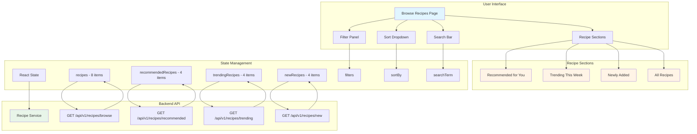

---

## Features

### 1. Recipe Discovery Sections

#### 1.1 Recommended for You
**Purpose**: Personalized recipe recommendations based on user preferences and history.

**Specifications**:
- **Recipe Limit**: 4 recipes
- **API Endpoint**: `GET /api/v1/recipes/recommended?limit=4`
- **Fetch Timing**: On page mount (once)
- **Pagination**: None (fixed 4 items)
- **View All**: Button navigates to full recommendations page (TODO)

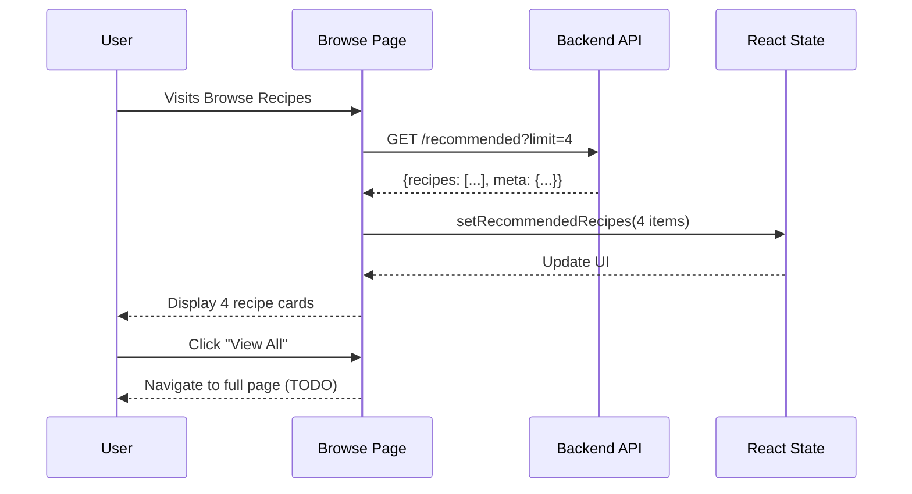

---

#### 1.2 Trending This Week
**Purpose**: Show recipes gaining popularity based on views and interactions in the last 7 days.

**Specifications**:
- **Recipe Limit**: 4 recipes
- **API Endpoint**: `GET /api/v1/recipes/trending?limit=4&period=7d`
- **Time Period**: Last 7 days
- **Fetch Timing**: On page mount (once)
- **Pagination**: None (fixed 4 items)
- **Empty State**: Shows "No trending recipes available at the moment"
- **View All**: Button navigates to full trending page (TODO)

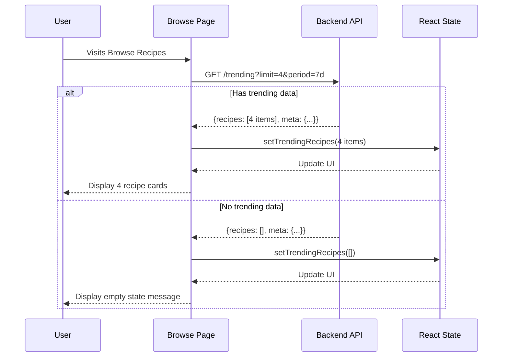

**Empty State Behavior**:
- Section remains visible even with 0 recipes
- Shows icon and message: "No trending recipes available at the moment"
- This happens when there isn't enough recipe activity in the last 7 days

---

#### 1.3 Newly Added
**Purpose**: Display the most recently published/approved recipes.

**Specifications**:
- **Recipe Limit**: 4 recipes
- **API Endpoint**: `GET /api/v1/recipes/new?limit=4`
- **Fetch Timing**: On page mount (once)
- **Pagination**: None (fixed 4 items)
- **Sorting**: By `createdAt` descending
- **View All**: Button navigates to full new recipes page (TODO)

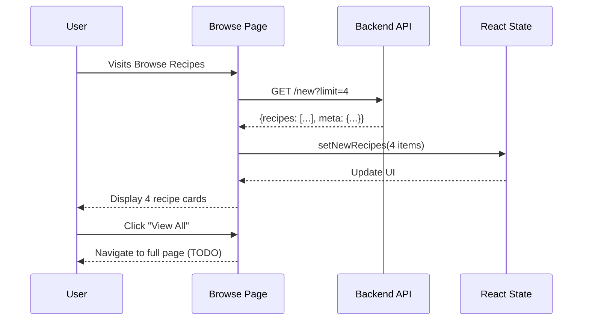

---

#### 1.4 All Recipes
**Purpose**: Main browsable recipe list with filters, sorting, and pagination.

**Specifications**:
- **Initial Limit**: 8 recipes
- **API Endpoint**: `GET /api/v1/recipes/browse?limit=8&page=1`
- **Fetch Timing**: 
  - On page mount
  - When filters change
  - When sorting changes
- **Pagination**: "Load More" button (loads 8 more each click)
- **Supports**: Full filtering, sorting, and search

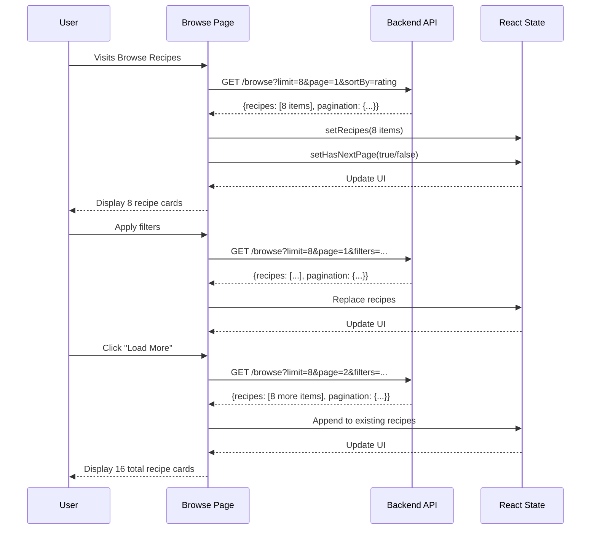

---

### 2. Advanced Filtering System

The filtering system provides 30+ filter combinations across 6 categories.

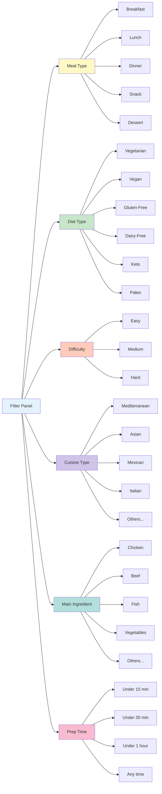

#### Filter Categories

| Category | Type | Options | API Parameter |
|----------|------|---------|---------------|
| **Meal Type** | Multi-select checkbox | 5 options | `mealType[]` |
| **Diet Type** | Multi-select checkbox | 6 options | `isVegetarian`, `isVegan`, etc. |
| **Difficulty** | Multi-select checkbox | 3 options | `difficulty[]` |
| **Cuisine Type** | Single-select dropdown | 8+ options | `cuisineType` |
| **Main Ingredient** | Single-select dropdown | 8+ options | `mainIngredient` |
| **Prep Time** | Single-select radio | 4 options | `maxPrepTime` |

#### Filter Behavior Flow

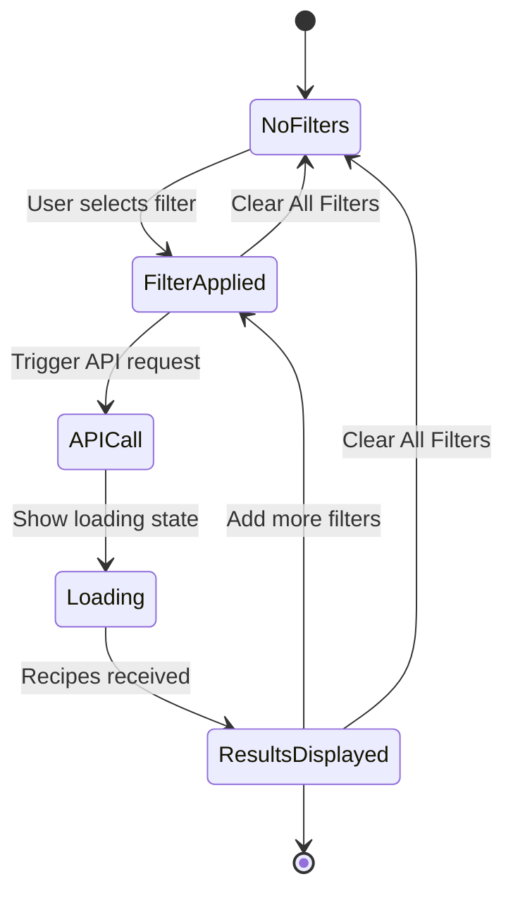

#### Active Filter Display

When filters are applied, they appear as **removable badge chips**:
- Color-coded by filter type
- Individual "X" button to remove each filter
- "Clear All Filters" button to reset everything

---

### 3. Search Functionality

**Current Status**: Placeholder (TODO - backend not ready)

**Planned Features**:
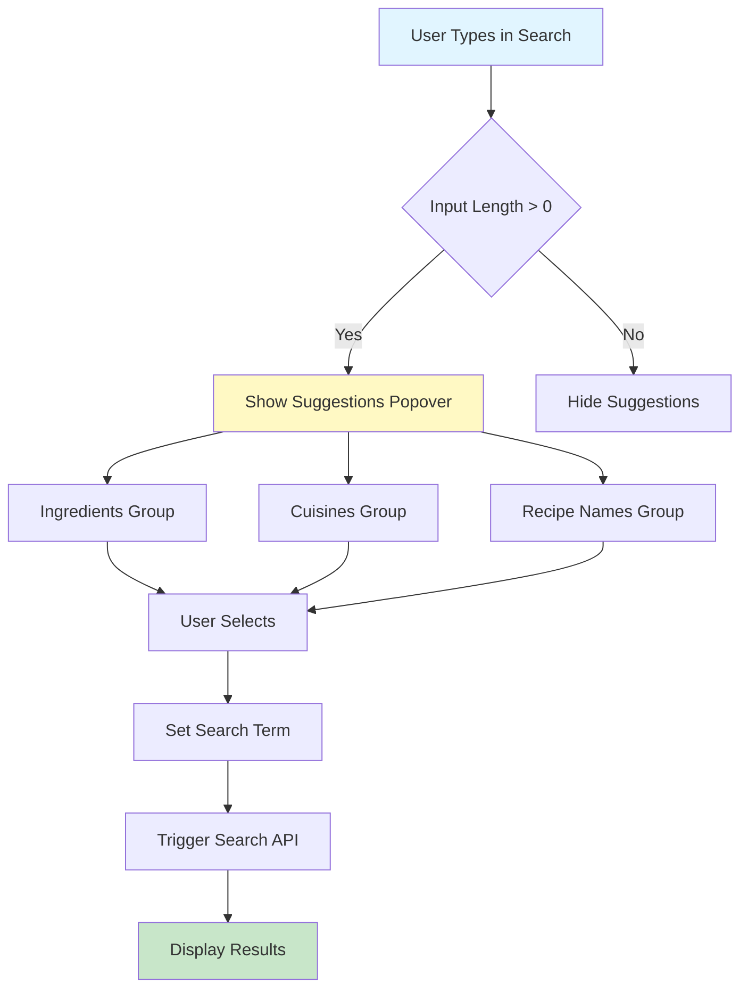

**Placeholder Behavior**:
- Search input is functional
- Logs search term to console
- Does not filter results yet
- Suggestions dropdown is empty

---

### 4. Sorting Options

Users can sort the "All Recipes" section by:

| Option | Value | API Parameter | Description |
|--------|-------|---------------|-------------|
| **Highest Rating** | `rating` | `sortBy=rating&sortOrder=desc` | Default - Best rated first |
| **Most Recent** | `recent` | `sortBy=createdAt&sortOrder=desc` | Newest recipes first |
| **Prep Time (Low to High)** | `prep-time-asc` | `sortBy=prepTime&sortOrder=asc` | Quickest recipes first |
| **Prep Time (High to Low)** | `prep-time-desc` | `sortBy=prepTime&sortOrder=desc` | Longest recipes first |

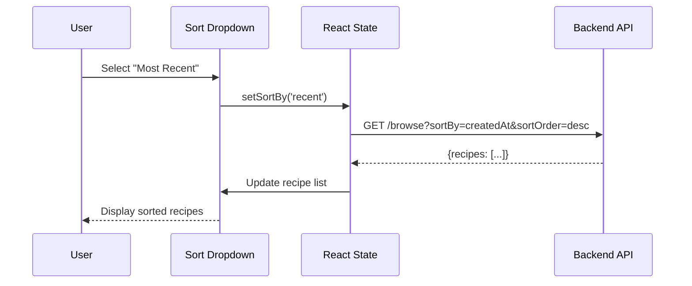

**Behavior**:
- Sorting triggers a new API call
- Resets to page 1
- Preserves active filters
- Shows loading state during fetch

---

### 5. Pagination

Only the **"All Recipes"** section supports pagination.

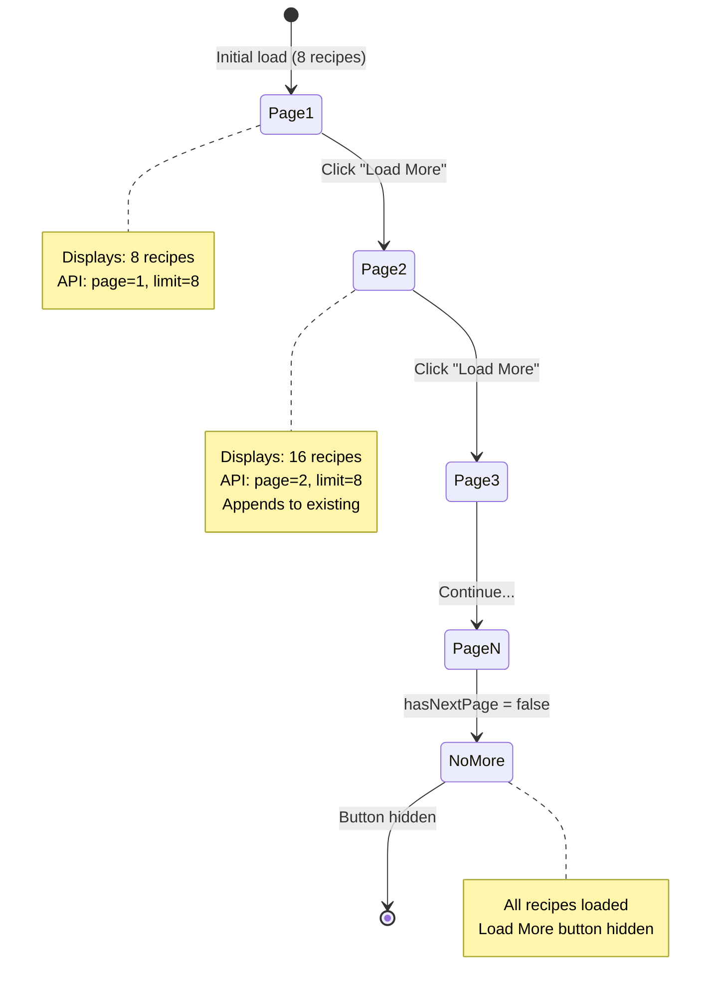

**Implementation Details**:
- **Load More Button**: Appears only when `hasNextPage === true`
- **Loading State**: Button shows "Loading..." when fetching
- **Append Mode**: New recipes are added to existing list (not replaced)
- **Filter Reset**: Changing filters resets to page 1

---

## API Integration

### API Endpoints Summary

| Endpoint | Method | Purpose | Limit | Pagination |
|----------|--------|---------|-------|------------|
| `/api/v1/recipes/browse` | GET | Main recipe list with filters | 8 | Yes |
| `/api/v1/recipes/recommended` | GET | Personalized recommendations | 4 | No |
| `/api/v1/recipes/trending` | GET | Popular recipes (7 days) | 4 | No |
| `/api/v1/recipes/new` | GET | Recently added recipes | 4 | No |

### Request/Response Flow

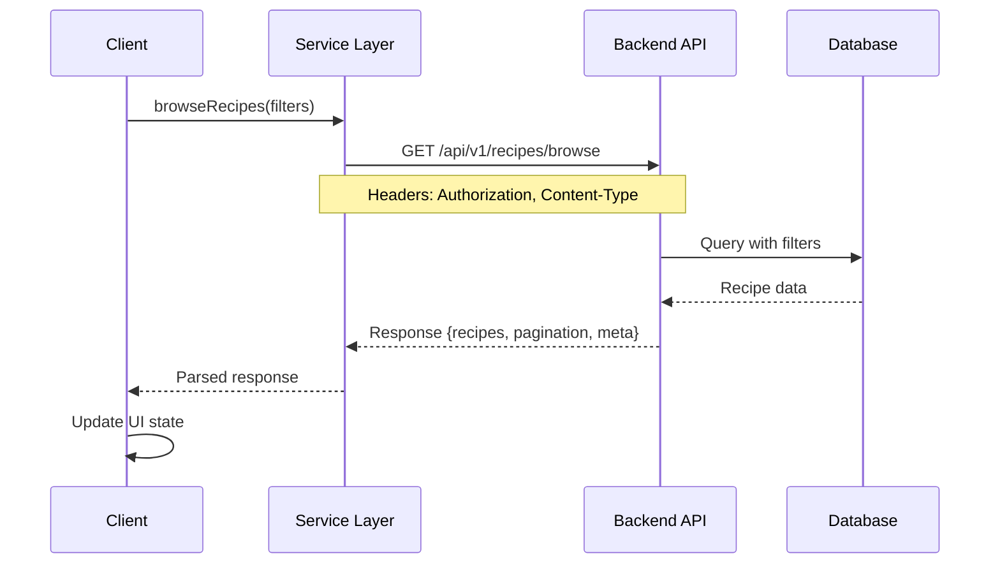

### Example API Request

```http
GET /api/v1/recipes/browse?page=1&limit=8&sortBy=rating&sortOrder=desc&isVegan=true&difficulty=EASY&maxPrepTime=30
Authorization: Bearer <jwt-token>
Content-Type: application/json
```

### Example API Response

```json
{
  "recipes": [
    {
      "id": "recipe-123",
      "title": "Vegan Buddha Bowl",
      "description": "Healthy and delicious plant-based bowl",
      "imageUrls": ["https://..."],
      "prepTime": 15,
      "cookingTime": 10,
      "difficulty": "EASY",
      "mealType": ["LUNCH", "DINNER"],
      "averageRating": 4.8,
      "totalRatings": 42,
      "author": {
        "id": "user-456",
        "firstName": "John",
        "lastName": "Doe"
      },
      "dietaryInfo": {
        "isVegan": true,
        "isGlutenFree": true
      }
    }
  ],
  "pagination": {
    "page": 1,
    "limit": 8,
    "total": 156,
    "totalPages": 20,
    "hasNext": true,
    "hasPrev": false
  },
  "meta": {
    "timestamp": "2025-11-01T10:30:00Z"
  }
}
```

---

## User Flows

### Flow 1: Browse Without Filters

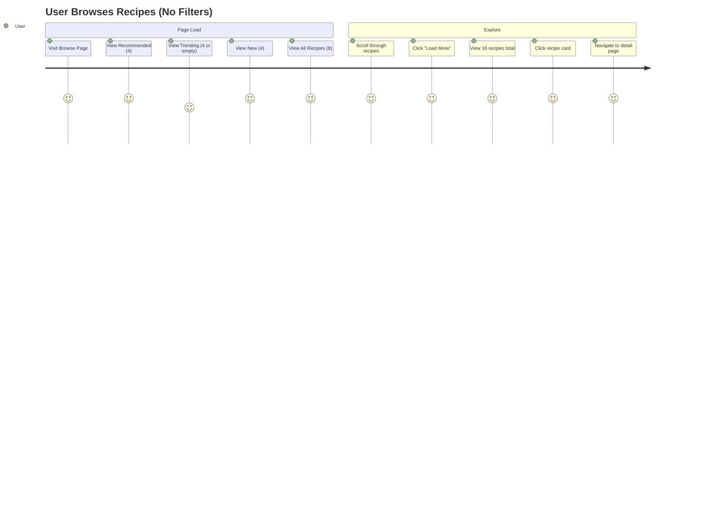

---

### Flow 2: Browse With Filters

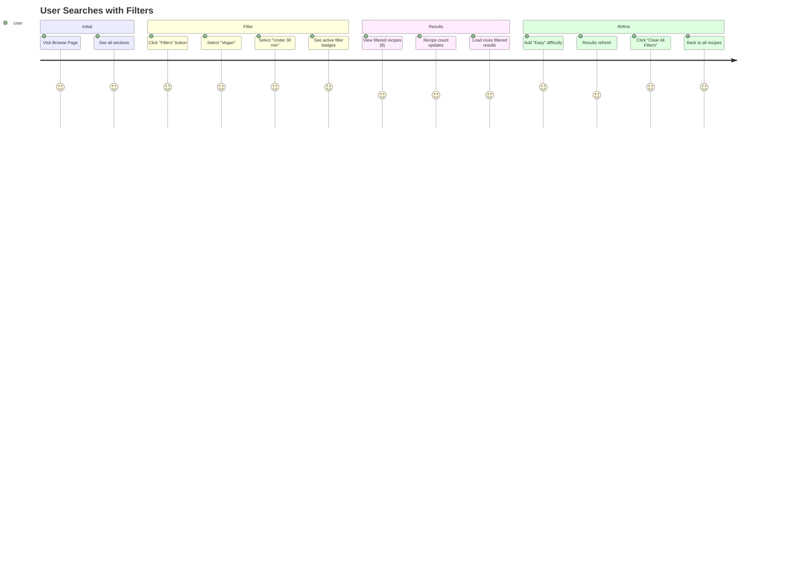

---

### Flow 3: Sort and Paginate

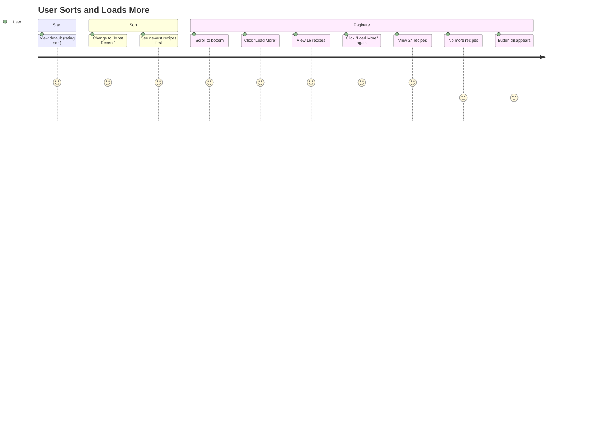

---

## Technical Implementation

### Component Structure

```
BrowseRecipesPage
├── Header Section
│   ├── Title: "Discover Healthy Recipes"
│   └── Subtitle
├── Search & Filters Panel
│   ├── Search Input (with suggestions popover)
│   ├── Filters Button (toggles panel)
│   ├── Filter Panel (collapsible)
│   │   ├── Meal Type Checkboxes
│   │   ├── Diet Type Checkboxes
│   │   ├── Difficulty Checkboxes
│   │   ├── Cuisine Type Dropdown
│   │   ├── Main Ingredient Dropdown
│   │   └── Prep Time Radio Buttons
│   ├── Active Filters Display (badge chips)
│   └── Sort Dropdown
├── Recipe Sections
│   ├── Recommended for You
│   │   ├── Section Header + "View All" Button
│   │   └── 4 Recipe Cards (grid: 1/2/4 cols)
│   ├── Trending This Week
│   │   ├── Section Header + "View All" Button
│   │   └── 4 Recipe Cards or Empty State
│   ├── Newly Added
│   │   ├── Section Header + "View All" Button
│   │   └── 4 Recipe Cards (grid: 1/2/4 cols)
│   └── All Recipes
│       ├── Section Header
│       ├── 8+ Recipe Cards (grid: 1/2/3/4 cols)
│       └── "Load More" Button (conditional)
└── Recipe Card Component (reusable)
    ├── Image + Rating Badge
    ├── Title (1 line, truncated)
    ├── Description (2 lines, truncated)
    ├── Time + Difficulty + Author
    └── Dietary Badges (up to 6)
```

### State Management

```typescript
// Recipe Data
const [recipes, setRecipes] = useState<Recipe[]>([]);                    // All Recipes section
const [recommendedRecipes, setRecommendedRecipes] = useState<Recipe[]>([]);  // 4 items
const [trendingRecipes, setTrendingRecipes] = useState<Recipe[]>([]);        // 4 items or []
const [newRecipes, setNewRecipes] = useState<Recipe[]>([]);                  // 4 items

// UI State
const [loading, setLoading] = useState(true);                            // Initial load
const [showFilters, setShowFilters] = useState(false);                   // Filter panel toggle
const [showSuggestions, setShowSuggestions] = useState(false);           // Search suggestions

// Filter State
const [searchTerm, setSearchTerm] = useState('');                        // Search input
const [filters, setFilters] = useState<RecipeFilters>({});               // All active filters
const [sortBy, setSortBy] = useState<SortOption>('rating');              // Sort option

// Pagination State
const [currentPage, setCurrentPage] = useState(1);                       // Current page number
const [hasNextPage, setHasNextPage] = useState(false);                   // More pages available
const [isFetchingNextPage, setIsFetchingNextPage] = useState(false);     // Loading next page
```

### Key Functions

| Function | Purpose | Triggers |
|----------|---------|----------|
| `fetchRecipes()` | Load main recipe list | Mount, filter change, sort change |
| `fetchSpecialSections()` | Load 3 special sections | Mount (once) |
| `handleSearch()` | Process search submission | Search form submit |
| `loadMoreRecipes()` | Load next page | "Load More" button click |
| `setFilters()` | Update active filters | Filter checkbox/dropdown change |
| `setSortBy()` | Change sort order | Sort dropdown change |

---

## Summary

### Recipe Counts Per Section

| Section | Initial Load | Can Load More | Total Possible |
|---------|--------------|---------------|----------------|
| Recommended for You | 4 | ❌ No | 4 |
| Trending This Week | 0-4 | ❌ No | 4 |
| Newly Added | 4 | ❌ No | 4 |
| All Recipes | 8 | ✅ Yes | Unlimited (paginated) |
| **Total Initial** | **20** | - | - |

### User Actions Available

✅ **Implemented**:
- Browse 4 curated sections
- Apply 30+ filter combinations
- Sort by 4 different options
- Load more recipes (pagination)
- View empty states
- Remove individual filters
- Clear all filters

⏳ **Pending (TODO)**:
- Search functionality
- Search suggestions
- "View All" buttons for special sections
- Full section pages (Recommended/Trending/New)

---

**Last Updated**: November 1, 2025  
**Version**: 1.0  
**Status**: ✅ Production Ready (with noted TODOs)
