```mermaid
sequenceDiagram
    participant User
    participant UI as Recipe Detail Page
    participant Dialog as shadcn/ui ConfirmDialog
    participant API as Backend API
    
    User->>UI: Clicks on their rated star (e.g., 4★)
    UI->>Dialog: Show ConfirmDialog component
    Dialog-->>User: Beautiful modal with icon and message
    
    alt User Confirms
        User->>Dialog: Click "Remove Rating" button
        Dialog->>API: DELETE /api/v1/community/recipes/:id/ratings/me
        API-->>UI: Return updated recipe stats
        UI->>UI: Update userRating to 0
        UI->>UI: Update recipe.averageRating
        UI->>UI: Update recipe.totalRatings
        Dialog->>Dialog: Close modal with fade-out animation
        UI-->>User: Stars reset to unrated state
    else User Cancels
        User->>Dialog: Click "Cancel" or press Escape or click backdrop
        Dialog->>Dialog: Close modal with fade-out animation
        UI-->>User: Rating remains unchanged
    end
```

# Rating & Comment Deletion Feature

## Overview
Enhanced user interaction on the Recipe Detail Page to allow users to delete their own ratings and comments with **beautiful shadcn/ui confirmation dialogs** instead of browser alerts.

## Features Implemented

### 1. **Delete Rating by Clicking Same Star** ⭐

#### User Flow


#### Implementation Details

**New Component**: `src/components/ui/confirm-dialog.tsx`

A reusable shadcn/ui style confirmation dialog component:

```typescript
interface ConfirmDialogProps {
  open: boolean;
  onOpenChange: (open: boolean) => void;
  onConfirm: () => void;
  title: string;
  description: string;
  confirmText?: string;
  cancelText?: string;
  variant?: 'default' | 'destructive';
  icon?: React.ReactNode;
}
```

**Features**:
- ✅ **Backdrop with blur effect** - Darkened background with backdrop-blur
- ✅ **Smooth animations** - Fade-in and zoom-in entrance animations
- ✅ **Keyboard support** - Press Escape to close
- ✅ **Click outside to close** - Click backdrop to dismiss
- ✅ **Custom icon support** - Warning icon for destructive actions
- ✅ **Variant styling** - Default or destructive button variants
- ✅ **Accessibility** - Proper ARIA attributes and roles
- ✅ **Body scroll lock** - Prevents scrolling when modal is open

**Location**: `src/pages/RecipeDetailPage.tsx`

**State Management**:
```typescript
// Confirmation dialog state
const [deleteRatingDialog, setDeleteRatingDialog] = useState(false);
const [ratingToDelete, setRatingToDelete] = useState(0);
```

**Logic**:
```typescript
const handleRating = async (rating: number) => {
  if (!user) {
    alert('Please login to rate this recipe');
    return;
  }

  if (!id) return;

  // If clicking on the same star rating, show delete confirmation dialog
  if (rating === userRating) {
    setRatingToDelete(rating);
    setDeleteRatingDialog(true);
    return;
  }

  // Otherwise, submit new rating (existing logic)
  // ...
};

const confirmDeleteRating = async () => {
  if (!id) return;

  setIsSubmittingRating(true);
  try {
    const result = await deleteRating(id);
    setUserRating(0);
    
    // Update recipe stats
    if (recipe) {
      setRecipe({
        ...recipe,
        averageRating: result.recipeStats.averageRating,
        totalRatings: result.recipeStats.totalRatings,
      });
    }
  } catch (error) {
    console.error('Error deleting rating:', error);
    alert('Failed to delete rating. Please try again.');
  } finally {
    setIsSubmittingRating(false);
  }
};
```

**JSX**:
```tsx
<ConfirmDialog
  open={deleteRatingDialog}
  onOpenChange={setDeleteRatingDialog}
  onConfirm={confirmDeleteRating}
  title="Remove Your Rating?"
  description={`Are you sure you want to remove your ${ratingToDelete}-star rating? This action will update the recipe's average rating.`}
  confirmText="Remove Rating"
  cancelText="Cancel"
  variant="destructive"
  icon={<AlertTriangle className="h-6 w-6 text-red-600" />}
/>
```

**UI Enhancements**:
- ✅ Added tooltip on hover: `"Click to remove your 4-star rating"` when hovering over rated star
- ✅ Updated status text: `"You rated this 4 stars (click to remove)"` instead of just `"You rated this 4 stars"`
- ✅ Visual feedback: Stars remain yellow/filled until deleted
- ✅ **Beautiful shadcn/ui modal dialog** with:
  - Red warning icon (AlertTriangle)
  - Clear title: "Remove Your Rating?"
  - Descriptive message with star count
  - Cancel button (outline style)
  - Remove Rating button (destructive/red style)
  - Backdrop blur and fade animations
  - Keyboard shortcuts (Escape to close)

**API Endpoint Used**:
```typescript
DELETE /api/v1/community/recipes/:recipeId/ratings/me
```

**Response**:
```json
{
  "status": "success",
  "data": {
    "recipeStats": {
      "averageRating": 4.2,
      "totalRatings": 15
    }
  },
  "message": "Rating deleted successfully"
}
```

---

### 2. **Delete Comment Confirmation** 💬

#### User Flow


#### Implementation Details

**State Management**:
```typescript
const [deleteCommentDialog, setDeleteCommentDialog] = useState(false);
const [commentToDelete, setCommentToDelete] = useState<string | null>(null);
```

**Logic**:
```typescript
const handleCommentDelete = async (commentId: string) => {
  setCommentToDelete(commentId);
  setDeleteCommentDialog(true);
};

const confirmDeleteComment = async () => {
  if (!id || !commentToDelete) return;

  try {
    await deleteComment(id, commentToDelete);
    
    // Remove comment from the list
    setComments(prev => prev.filter(c => c.id !== commentToDelete));
    
    // Update recipe total comments
    if (recipe) {
      setRecipe({
        ...recipe,
        totalComments: Math.max(0, (recipe.totalComments || 0) - 1),
      });
    }
  } catch (error) {
    console.error('Error deleting comment:', error);
    alert('Failed to delete comment. Please try again.');
  }
};
```

**JSX**:
```tsx
<ConfirmDialog
  open={deleteCommentDialog}
  onOpenChange={setDeleteCommentDialog}
  onConfirm={confirmDeleteComment}
  title="Delete Comment?"
  description="Are you sure you want to delete this comment? This action cannot be undone."
  confirmText="Delete"
  cancelText="Cancel"
  variant="destructive"
  icon={<AlertTriangle className="h-6 w-6 text-red-600" />}
/>
```

**UI Elements**:
- ✅ Delete button only visible for **user's own comments**
- ✅ Trash icon with hover effect (gray → red on hover)
- ✅ Tooltip: `"Delete comment"`
- ✅ **Beautiful shadcn/ui modal dialog** with:
  - Red warning icon (AlertTriangle)
  - Clear title: "Delete Comment?"
  - Warning message: "This action cannot be undone"
  - Cancel button (outline style)
  - Delete button (destructive/red style)
  - Backdrop blur and fade animations
  - Keyboard shortcuts (Escape to close)

**API Endpoint Used**:
```typescript
DELETE /api/v1/community/recipes/:recipeId/comments/:commentId
```

**Response**:
```json
{
  "status": "success",
  "message": "Comment deleted successfully"
}
```

---

## User Experience Flow

### Rating Deletion Scenario
1. **User has rated a recipe 4 stars** ⭐⭐⭐⭐☆
2. **Hover over the 4th star**: Tooltip shows "Click to remove your 4-star rating"
3. **Click the 4th star**: Confirmation dialog appears
   ```
   Are you sure you want to remove your 4-star rating?
   [Cancel] [OK]
   ```
4. **User clicks OK**:
   - Stars reset to ☆☆☆☆☆ (unrated)
   - Recipe stats updated (average rating may change)
   - Status text: "Click to rate"
5. **User can rate again**: Click any star to submit new rating

### Comment Deletion Scenario
1. **User sees their comment** with edit and delete buttons
2. **Hover over trash icon**: Changes from gray to red
3. **Click trash icon**: Confirmation dialog appears
   ```
   Are you sure you want to delete this comment? This action cannot be undone.
   [Cancel] [OK]
   ```
4. **User clicks OK**:
   - Comment removed from list immediately
   - Total comment count decremented
   - Smooth animation (fade out)

---

## Technical Specifications

### Services Used

**From**: `src/services/recipe.ts`

```typescript
/**
 * Delete user's rating for a recipe
 * @param recipeId Recipe ID
 * @returns Updated recipe stats
 */
export async function deleteRating(recipeId: string): Promise<{
  recipeStats: {
    averageRating: number;
    totalRatings: number;
  };
}>

/**
 * Delete a comment (user's own comment or admin)
 * @param recipeId Recipe ID
 * @param commentId Comment ID
 */
export async function deleteComment(recipeId: string, commentId: string): Promise<void>
```

### State Management

**Rating State**:
```typescript
const [userRating, setUserRating] = useState(0);
const [isSubmittingRating, setIsSubmittingRating] = useState(false);
```

**Comment State**:
```typescript
const [comments, setComments] = useState<CommentItem[]>([]);
const [editingCommentId, setEditingCommentId] = useState<string | null>(null);
```

### Error Handling

**Rating Deletion Errors**:
- **Not authenticated**: Alert "Please login to rate this recipe"
- **API error**: Alert "Failed to delete rating. Please try again."
- **Network error**: Caught and logged to console

**Comment Deletion Errors**:
- **Not authenticated**: Delete button not visible
- **Not owner**: Delete button not visible (only own comments)
- **API error**: Alert "Failed to delete comment. Please try again."

---

## Confirmation Dialog Component

### shadcn/ui ConfirmDialog

**New Component**: `src/components/ui/confirm-dialog.tsx`

A reusable, accessible confirmation dialog built with shadcn/ui patterns.

**Features**:
- ✅ **Modal overlay** with backdrop blur (`bg-black/50 backdrop-blur-sm`)
- ✅ **Smooth animations** (`fade-in-0 zoom-in-95 duration-200`)
- ✅ **Keyboard support** - Press `Escape` to dismiss
- ✅ **Click outside to close** - Click backdrop to cancel
- ✅ **Custom icon support** - Display warning icons for destructive actions
- ✅ **Variant styling** - `default` or `destructive` button variants
- ✅ **Accessibility** - Proper ARIA attributes (`role="alertdialog"`, `aria-labelledby`, `aria-describedby`)
- ✅ **Body scroll lock** - Prevents page scrolling when modal is open
- ✅ **Responsive** - Works on mobile, tablet, and desktop
- ✅ **Tailwind CSS** - Fully styled with utility classes

**Props Interface**:
```typescript
interface ConfirmDialogProps {
  open: boolean;                    // Control dialog visibility
  onOpenChange: (open: boolean) => void;  // Callback when dialog state changes
  onConfirm: () => void;             // Callback when user confirms
  title: string;                     // Dialog title
  description: string;               // Dialog message
  confirmText?: string;              // Confirm button text (default: "Confirm")
  cancelText?: string;               // Cancel button text (default: "Cancel")
  variant?: 'default' | 'destructive'; // Button variant (default: "default")
  icon?: React.ReactNode;            // Optional icon to display
}
```

**Usage Example**:
```tsx
import { ConfirmDialog } from '@/components/ui/confirm-dialog';
import { AlertTriangle } from 'lucide-react';

function MyComponent() {
  const [showDialog, setShowDialog] = useState(false);

  const handleDelete = () => {
    console.log('Deleting...');
  };

  return (
    <>
      <button onClick={() => setShowDialog(true)}>Delete</button>
      
      <ConfirmDialog
        open={showDialog}
        onOpenChange={setShowDialog}
        onConfirm={handleDelete}
        title="Delete Item?"
        description="This action cannot be undone."
        confirmText="Delete"
        cancelText="Cancel"
        variant="destructive"
        icon={<AlertTriangle className="h-6 w-6 text-red-600" />}
      />
    </>
  );
}
```

---

## Dialog Variations

### Rating Deletion Dialog
```tsx
<ConfirmDialog
  open={deleteRatingDialog}
  onOpenChange={setDeleteRatingDialog}
  onConfirm={confirmDeleteRating}
  title="Remove Your Rating?"
  description={`Are you sure you want to remove your ${ratingToDelete}-star rating? This action will update the recipe's average rating.`}
  confirmText="Remove Rating"
  cancelText="Cancel"
  variant="destructive"
  icon={<AlertTriangle className="h-6 w-6 text-red-600" />}
/>
```

**Visual Design**:
- 🔴 Red warning icon in circular background
- **Title**: "Remove Your Rating?" (bold, center-aligned)
- **Message**: Dynamic text showing star count
- **Buttons**: 
  - Cancel (outline, gray)
  - Remove Rating (solid red, destructive variant)

### Comment Deletion Dialog
```tsx
<ConfirmDialog
  open={deleteCommentDialog}
  onOpenChange={setDeleteCommentDialog}
  onConfirm={confirmDeleteComment}
  title="Delete Comment?"
  description="Are you sure you want to delete this comment? This action cannot be undone."
  confirmText="Delete"
  cancelText="Cancel"
  variant="destructive"
  icon={<AlertTriangle className="h-6 w-6 text-red-600" />}
/>
```

**Visual Design**:
- 🔴 Red warning icon in circular background
- **Title**: "Delete Comment?" (bold, center-aligned)
- **Message**: Emphasizes permanence
- **Buttons**: 
  - Cancel (outline, gray)
  - Delete (solid red, destructive variant)

---

## UI/UX Improvements

### Before Implementation
- ❌ **Rating**: No way to remove rating without refreshing page
- ❌ **Comment**: Generic browser `confirm()` dialog
- ❌ **Tooltips**: No hover hints on interactive elements
- ❌ **Visual Design**: Basic browser dialogs with no styling
- ❌ **User Experience**: Inconsistent UI patterns

### After Implementation
- ✅ **Rating**: Click same star to delete with beautiful confirmation dialog
- ✅ **Comment**: Professional shadcn/ui modal with clear messaging
- ✅ **Tooltips**: Helpful hints on hover (remove rating, rate X stars, delete comment)
- ✅ **Visual Feedback**: Text updates to show "(click to remove)" when rated
- ✅ **State Sync**: Recipe stats update immediately after deletion
- ✅ **Beautiful Modals**: 
  - Backdrop blur effect
  - Smooth fade and zoom animations
  - Red warning icons for destructive actions
  - Clear button hierarchy (Cancel vs Confirm)
  - Keyboard support (Escape to close)
  - Click outside to dismiss
  - Mobile-responsive design
- ✅ **Accessibility**: 
  - Proper ARIA roles and labels
  - Keyboard navigation support
  - Focus management
  - Screen reader friendly
- ✅ **Consistent Design**: Follows shadcn/ui patterns throughout the app

---

## Backend Integration

### API Endpoints

| Action | Method | Endpoint | Auth Required |
|--------|--------|----------|---------------|
| Delete Rating | `DELETE` | `/api/v1/community/recipes/:recipeId/ratings/me` | ✅ Yes (JWT) |
| Delete Comment | `DELETE` | `/api/v1/community/recipes/:recipeId/comments/:commentId` | ✅ Yes (JWT) |

### Authorization Rules

**Delete Rating**:
- User must be authenticated
- User can only delete their own rating
- Backend validates: `userId === rating.userId`

**Delete Comment**:
- User must be authenticated
- User can delete their own comment OR admin can delete any comment
- Backend validates: `userId === comment.userId || user.role === 'ADMIN'`

---

## Testing Scenarios

### ✅ Test Cases

#### Rating Deletion
1. **Unauthenticated user**: Cannot delete rating (not logged in)
2. **User with no rating**: Clicking star submits new rating (not delete)
3. **User with rating**: 
   - Click same star → Confirmation appears
   - Click Cancel → Rating unchanged
   - Click OK → Rating deleted, stats updated
4. **Network error**: Error message displayed, rating unchanged
5. **After deletion**: User can rate again normally

#### Comment Deletion
1. **User's own comment**: Delete button visible
2. **Other user's comment**: Delete button NOT visible (unless admin)
3. **Admin user**: Can delete any comment
4. **Click delete**:
   - Confirmation appears
   - Click Cancel → Comment unchanged
   - Click OK → Comment removed
5. **Network error**: Error message displayed, comment unchanged
6. **After deletion**: Total comment count decremented

---

## Future Enhancements

### Potential Improvements
- [ ] Undo functionality (soft delete with 5-second undo window)
- [ ] Animation when deleting comments (fade out effect)
- [ ] Bulk delete for admins
- [ ] Comment deletion reason (for admin moderation)
- [ ] Toast notifications for success messages
- [ ] Confirmation checkbox: "Don't ask again for this session"
- [ ] Sound effects for destructive actions (optional)

### Advanced Features
- [ ] Rating history timeline for users
- [ ] Comment edit history
- [ ] Report inappropriate comments
- [ ] Reactions/likes on comments
- [ ] Reply to comments (threaded discussions)
- [ ] User preferences for confirmation dialogs

### ✅ Already Implemented
- ✅ ~~Custom modal component instead of `window.confirm()`~~ - **DONE** (shadcn/ui ConfirmDialog)
- ✅ ~~Better visual design with icons and animations~~ - **DONE**
- ✅ ~~Keyboard shortcuts (Escape to close)~~ - **DONE**
- ✅ ~~Backdrop blur effect~~ - **DONE**

---

## Code Changes Summary

### New Files Created
1. **`src/components/ui/confirm-dialog.tsx`** ✨ **NEW**
   - Reusable shadcn/ui confirmation dialog component
   - Props: open, onOpenChange, onConfirm, title, description, confirmText, cancelText, variant, icon
   - Features: backdrop blur, animations, keyboard support, accessibility
   - Styling: Tailwind CSS with destructive variant support

### Modified Files
1. **`src/pages/RecipeDetailPage.tsx`**
   - Added `ConfirmDialog` import from `@/components/ui/confirm-dialog`
   - Added `AlertTriangle` icon import from `lucide-react`
   - Added confirmation dialog state:
     - `deleteRatingDialog`, `setDeleteRatingDialog`
     - `ratingToDelete`, `setRatingToDelete`
     - `deleteCommentDialog`, `setDeleteCommentDialog`
     - `commentToDelete`, `setCommentToDelete`
   - Enhanced `handleRating()` to show dialog instead of `window.confirm()`
   - Created `confirmDeleteRating()` function for actual deletion
   - Enhanced `handleCommentDelete()` to show dialog
   - Created `confirmDeleteComment()` function for actual deletion
   - Added two `<ConfirmDialog>` components to JSX (rating and comment)
   - Added tooltips to rating stars
   - Updated rating status text to show "(click to remove)"

2. **`RATING_COMMENT_DELETE_FEATURE.md`** (this file)
   - Complete documentation update
   - Added ConfirmDialog component details
   - Updated all examples to reflect shadcn/ui implementation

---

## Related Documentation
- **[RATING_COMMENT_API_IMPLEMENTATION.md](./RATING_COMMENT_API_IMPLEMENTATION.md)** - Backend API integration guide
- **[RATING_COMMENT_INTEGRATION_COMPLETE.md](./RATING_COMMENT_INTEGRATION_COMPLETE.md)** - Initial rating/comment feature docs
- **[TESTING.md](./TESTING.md)** - Testing guidelines

---

**Last Updated**: November 1, 2025  
**Status**: ✅ Fully Implemented and Production Ready
