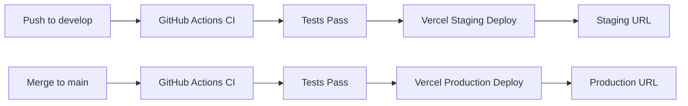

# FitRecipes Frontend - Vercel Deployment Guide

**Last Updated**: December 11, 2025

This guide will walk you through deploying the FitRecipes frontend to Vercel with separate **Production** and **Staging** environments.

---

## 📋 Prerequisites

Before you begin, ensure you have:

- ✅ A [Vercel account](https://vercel.com/signup) (free tier works)
- ✅ GitHub repository access (fork or clone FitRecipes-Frontend)
- ✅ Backend API deployed and accessible
- ✅ Firebase project configured (for push notifications)
- ✅ (Optional) Search API endpoint (for smart search feature)

---

## 🚀 Quick Start (Recommended)

### Step 1: Create Two Vercel Projects

You'll create **two separate projects** on Vercel:
1. **Production** - Connected to `main` branch
2. **Staging** - Connected to `develop` branch

---

## 🏗️ Production Deployment

### 1. Import Project

1. Go to [Vercel Dashboard](https://vercel.com/dashboard)
2. Click **"Add New..." → "Project"**
3. Select **"Import Git Repository"**
4. Choose your **FitRecipes-Frontend** repository
5. Click **"Import"**

### 2. Configure Production Project

**Project Settings:**
- **Project Name**: `fitrecipes-frontend-production` (or your choice)
- **Framework Preset**: **Vite** (auto-detected)
- **Root Directory**: `./` (leave as default)
- **Build Command**: `npm run build`
- **Output Directory**: `dist`
- **Install Command**: `npm ci`

### 3. Set Environment Variables

Click **"Environment Variables"** and add the following:

| Variable Name | Value | Required |
|--------------|-------|----------|
| `VITE_API_BASE_URL` | `https://your-backend-api.com` | ✅ Yes |
| `VITE_FRONTEND_URL` | `https://your-vercel-domain.vercel.app` | ✅ Yes |
| `VITE_FIREBASE_API_KEY` | Your Firebase API key | ✅ Yes |
| `VITE_FIREBASE_AUTH_DOMAIN` | `your-project.firebaseapp.com` | ✅ Yes |
| `VITE_FIREBASE_PROJECT_ID` | Your Firebase project ID | ✅ Yes |
| `VITE_FIREBASE_MESSAGING_SENDER_ID` | Your Firebase sender ID | ✅ Yes |
| `VITE_FIREBASE_APP_ID` | Your Firebase app ID | ✅ Yes |
| `VITE_FIREBASE_VAPID_KEY` | Your Firebase VAPID key | ✅ Yes |
| `VITE_SEARCH_API_BASE_URL` | `https://your-search-api.com` | ⚠️ Optional |
| `VITE_SEARCH_API_KEY` | Your search API key | ⚠️ Optional |

**Important Notes:**
- Set all variables for **"Production"** environment
- Search API variables are optional - app will gracefully fall back to browse mode
- Never commit these values to Git

### 4. Configure Git Branch

1. Go to **Settings → Git**
2. Set **Production Branch**: `main`
3. Save changes

### 5. Deploy

1. Click **"Deploy"**
2. Wait for build to complete (2-3 minutes)
3. Your production site is live! 🎉

**Production URL**: `https://your-project.vercel.app`

---

## 🧪 Staging Deployment

### 1. Create Second Project

1. Go back to [Vercel Dashboard](https://vercel.com/dashboard)
2. Click **"Add New..." → "Project"**
3. **Import the SAME repository again**
4. Click **"Import"**

### 2. Configure Staging Project

**Project Settings:**
- **Project Name**: `fitrecipes-frontend-staging` (or your choice)
- **Framework Preset**: **Vite**
- **Root Directory**: `./`
- **Build Command**: `npm run build`
- **Output Directory**: `dist`
- **Install Command**: `npm ci`

### 3. Set Environment Variables

Add the **same environment variables** as production, but with staging values:

| Variable Name | Value | Notes |
|--------------|-------|-------|
| `VITE_API_BASE_URL` | `https://staging-backend-api.com` | Staging backend |
| `VITE_FRONTEND_URL` | `https://staging-vercel-domain.vercel.app` | Staging URL |
| `VITE_FIREBASE_API_KEY` | Same as production or separate staging project | Your choice |
| `VITE_FIREBASE_AUTH_DOMAIN` | Same as production or separate staging project | Your choice |
| `VITE_FIREBASE_PROJECT_ID` | Same as production or separate staging project | Your choice |
| `VITE_FIREBASE_MESSAGING_SENDER_ID` | Same as production or separate staging project | Your choice |
| `VITE_FIREBASE_APP_ID` | Same as production or separate staging project | Your choice |
| `VITE_FIREBASE_VAPID_KEY` | Same as production or separate staging project | Your choice |
| `VITE_SEARCH_API_BASE_URL` | `https://staging-search-api.com` | Optional |
| `VITE_SEARCH_API_KEY` | Your staging search API key | Optional |

**Set variables for "Preview" and "Development" environments**

### 4. Configure Git Branch

1. Go to **Settings → Git**
2. Set **Production Branch**: `develop`
3. Save changes

**Important**: Even though it says "Production Branch", this controls which branch triggers deployments for this project.

### 5. Deploy

1. Click **"Deploy"**
2. Wait for build to complete
3. Your staging site is live! 🎉

**Staging URL**: `https://your-staging-project.vercel.app`

---

## 🔧 Post-Deployment Configuration

### Update Frontend URLs

After deployment, update the `VITE_FRONTEND_URL` variables:

**Production Project:**
1. Go to **Settings → Environment Variables**
2. Edit `VITE_FRONTEND_URL`
3. Set to your actual production URL (e.g., `https://fitrecipes.vercel.app`)
4. Click **"Save"**
5. **Redeploy** from **Deployments** tab

**Staging Project:**
1. Go to **Settings → Environment Variables**
2. Edit `VITE_FRONTEND_URL`
3. Set to your actual staging URL
4. Click **"Save"**
5. **Redeploy**

### Configure Backend CORS

Update your backend to allow requests from:
- Production: `https://fitrecipes.vercel.app`
- Staging: `https://your-staging-project.vercel.app`

### Update OAuth Redirect URIs

**Google OAuth Console:**
1. Go to [Google Cloud Console](https://console.cloud.google.com)
2. Navigate to **APIs & Services → Credentials**
3. Edit your OAuth 2.0 Client ID
4. Add **Authorized Redirect URIs**:
   - Production: `https://fitrecipes.vercel.app/oauth/callback`
   - Staging: `https://your-staging-project.vercel.app/oauth/callback`
5. Save changes

---

## 🔄 Automatic Deployments

Once configured, deployments happen automatically:

### Production Workflow
```
Push to 'main' branch → GitHub Actions CI/CD runs → Vercel deploys to production
```

**Trigger**: Push or merge to `main` branch

### Staging Workflow
```
Push to 'develop' branch → GitHub Actions CI/CD runs → Vercel deploys to staging
```

**Trigger**: Push or merge to `develop` branch

---

## 📝 Environment Variables Reference

### Required Variables

| Variable | Description | Example |
|----------|-------------|---------|
| `VITE_API_BASE_URL` | Backend API URL | `https://fitrecipes-backend.onrender.com` |
| `VITE_FRONTEND_URL` | Frontend URL (for OAuth redirects) | `https://fitrecipes.vercel.app` |
| `VITE_FIREBASE_API_KEY` | Firebase configuration | `AIza...` |
| `VITE_FIREBASE_AUTH_DOMAIN` | Firebase auth domain | `project.firebaseapp.com` |
| `VITE_FIREBASE_PROJECT_ID` | Firebase project ID | `fitrecipes-123` |
| `VITE_FIREBASE_MESSAGING_SENDER_ID` | Firebase sender ID | `123456789` |
| `VITE_FIREBASE_APP_ID` | Firebase app ID | `1:123:web:abc` |
| `VITE_FIREBASE_VAPID_KEY` | Firebase VAPID key for push notifications | `BM7x...` |

### Optional Variables

| Variable | Description | Default Behavior |
|----------|-------------|------------------|
| `VITE_SEARCH_API_BASE_URL` | Vector search API endpoint | Falls back to browse mode |
| `VITE_SEARCH_API_KEY` | Search API authentication key | Not required if API is public |
| `VITE_DEBUG` | Enable debug logging | `false` |

---

## 🛠️ Troubleshooting

### Build Failures

**Issue**: Build fails with missing dependencies
```bash
Error: Cannot find module 'xyz'
```
**Solution**: Ensure `package.json` includes all dependencies, commit and push.

---

**Issue**: TypeScript errors during build
```bash
TS2304: Cannot find name 'xyz'
```
**Solution**: 
1. Run `npm run build` locally to check for errors
2. Fix TypeScript issues
3. Push fixed code

---

### Environment Variable Issues

**Issue**: `VITE_API_BASE_URL is undefined`

**Solution**:
1. Go to Vercel **Settings → Environment Variables**
2. Verify all variables are set correctly
3. Click **Redeploy** on latest deployment
4. **Important**: Environment variables require redeployment to take effect

---

**Issue**: OAuth redirect not working

**Solution**:
1. Check `VITE_FRONTEND_URL` matches your actual Vercel domain
2. Update Google OAuth Console with correct redirect URIs
3. Include `/oauth/callback` path in redirect URI

---

### CORS Errors

**Issue**: `Access-Control-Allow-Origin` errors in browser console

**Solution**:
1. Update backend CORS configuration
2. Add Vercel domains to allowed origins:
   ```javascript
   // Example backend CORS config
   cors({
     origin: [
       'https://fitrecipes.vercel.app',           // Production
       'https://staging-fitrecipes.vercel.app',   // Staging
       'http://localhost:5173'                     // Development
     ]
   })
   ```

---

### Push Notifications Not Working

**Issue**: Browser notifications not appearing

**Solution**:
1. Verify all Firebase environment variables are set
2. Check browser notification permissions
3. Ensure Firebase project has Cloud Messaging enabled
4. Test with different browsers (Chrome, Firefox, Safari)

---

## 🔒 Security Best Practices

1. ✅ **Never commit `.env.local`** - Already in `.gitignore`
2. ✅ **Use Vercel environment variables** - Not hardcoded values
3. ✅ **Separate Firebase projects** - Consider using different projects for staging/production
4. ✅ **Rotate API keys regularly** - Update in Vercel dashboard
5. ✅ **Enable Vercel's security headers** - Already configured in `vercel.json`
6. ✅ **Use HTTPS only** - Enforced by Vercel automatically

---

## 📊 Monitoring Deployments

### View Deployment Status

1. Go to **Deployments** tab in Vercel dashboard
2. See real-time build logs
3. Check deployment status (Building, Ready, Error)
4. Click deployment to see detailed logs

### Rollback Deployments

If something goes wrong:

1. Go to **Deployments** tab
2. Find previous working deployment
3. Click **"..."** → **"Promote to Production"**
4. Instant rollback! 🎯

---

## 🎯 Custom Domains (Optional)

### Add Custom Domain to Production

1. Purchase domain (e.g., `fitrecipes.com`)
2. In Vercel project, go to **Settings → Domains**
3. Click **"Add"**
4. Enter domain name: `fitrecipes.com` and `www.fitrecipes.com`
5. Follow DNS configuration instructions
6. Wait for DNS propagation (5-60 minutes)

### Add Subdomain for Staging

1. In staging project, go to **Settings → Domains**
2. Add subdomain: `staging.fitrecipes.com`
3. Configure DNS with provided records
4. Wait for propagation

---

## 📦 GitHub Actions Integration

Your repository already includes GitHub Actions CI/CD (`.github/workflows/cicd.yml`):

**Workflow:**
1. **Lint** → Code quality checks
2. **Type Check** → TypeScript validation
3. **Test** → Unit tests with coverage
4. **E2E Tests** → Playwright tests (auth.spec.ts on Chromium)
5. **Build** → Production build
6. **Deploy** → Vercel deployment (via Vercel's own Git integration)

**Note**: The workflow includes Vercel deployment steps. Make sure to add these secrets to your GitHub repository:

### Required GitHub Secrets

Go to **GitHub Repository → Settings → Secrets and variables → Actions**:

| Secret Name | Description | Where to Find |
|-------------|-------------|---------------|
| `VERCEL_TOKEN` | Vercel authentication token | [Vercel Settings → Tokens](https://vercel.com/account/tokens) |
| `VERCEL_ORG_ID` | Your Vercel organization ID | Run `vercel whoami` or check Vercel project settings |
| `VERCEL_PROJECT_ID` | Production project ID | Vercel project settings → General |
| `VERCEL_STAGING_PROJECT_ID` | Staging project ID | Vercel staging project settings → General |
| `CODECOV_TOKEN` | Code coverage reporting | Optional, for [Codecov](https://codecov.io) |

---

## ✅ Deployment Checklist

### Before First Deployment

- [ ] Backend API deployed and accessible
- [ ] Firebase project created and configured
- [ ] Google OAuth credentials set up
- [ ] All environment variables prepared
- [ ] Custom domain purchased (optional)

### Production Deployment

- [ ] Create production Vercel project
- [ ] Connect to `main` branch
- [ ] Set all environment variables
- [ ] Configure custom domain (optional)
- [ ] Deploy and test
- [ ] Update OAuth redirect URIs
- [ ] Test authentication flow
- [ ] Test push notifications

### Staging Deployment

- [ ] Create staging Vercel project
- [ ] Connect to `develop` branch
- [ ] Set all environment variables (staging values)
- [ ] Configure staging subdomain (optional)
- [ ] Deploy and test
- [ ] Update OAuth redirect URIs
- [ ] Verify staging backend connection

### Post-Deployment

- [ ] Update `VITE_FRONTEND_URL` with actual domains
- [ ] Configure backend CORS
- [ ] Test all features on production
- [ ] Test all features on staging
- [ ] Set up monitoring/alerts (optional)
- [ ] Document deployment URLs for team

---

## 🚦 Deployment Workflow Summary



**Development Flow:**
1. Develop feature on feature branch
2. Push to `develop` → Auto-deploy to **Staging**
3. Test on staging environment
4. Merge `develop` to `main` → Auto-deploy to **Production**

---

## 📞 Need Help?

- **Vercel Documentation**: https://vercel.com/docs
- **Vercel Support**: support@vercel.com
- **Project Issues**: https://github.com/NinePTH/FitRecipes-Frontend/issues
- **FitRecipes Support**: support@fitrecipes.com

---

## 🎉 You're Done!

Your FitRecipes frontend is now deployed with:
- ✅ Separate Production and Staging environments
- ✅ Automatic deployments from Git
- ✅ Environment variable management
- ✅ CI/CD pipeline with testing
- ✅ Security headers configured
- ✅ OAuth integration ready

**Happy Deploying!** 🚀
