# FitRecipes System Architecture

## Complete System Architecture Diagram

```mermaid
graph TB
    subgraph "Presentation Layer"
        WEB_APP[Web Application<br/>React 19 + TypeScript<br/>Vite 6]
        ADMIN_PANEL[Admin Dashboard<br/>React Components]
        CHEF_PANEL[Chef Dashboard<br/>React Components]
    end

    subgraph "Frontend Components"
        subgraph "Public Pages"
            LANDING[Landing Page<br/>Framer Motion]
            AUTH_PAGE[Auth Page<br/>Login/Register/OAuth]
            TERMS_PAGE[Terms & Verification]
        end
        
        subgraph "Protected Pages"
            BROWSE[Browse Recipes<br/>Vector Search]
            RECIPE_DETAIL[Recipe Details<br/>Ratings & Comments]
            MY_RECIPES[My Recipes<br/>Chef Dashboard]
            SUBMIT_RECIPE[Recipe Submission<br/>Image Upload]
        end
        
        subgraph "Admin Features"
            USER_MGMT_UI[User Management]
            RECIPE_APPROVAL[Recipe Approval]
            CONTENT_MOD[Content Moderation]
            SYSTEM_ANALYTICS[System Analytics]
        end
    end

    subgraph "State Management"
        AUTH_CONTEXT[Auth Context<br/>JWT + User State]
        REACT_QUERY[TanStack React Query<br/>Server State Cache]
        SAVED_RECIPES_CTX[Saved Recipes Context]
    end

    subgraph "Frontend Services"
        API_CLIENT[API Client<br/>Axios Wrapper]
        AUTH_SERVICE[Auth Service<br/>Token Management]
        RECIPE_SERVICE[Recipe Service]
        NOTIFICATION_CLIENT[Notification Service]
        PUSH_SERVICE[Push Notifications<br/>FCM Web]
    end

    subgraph "API Layer"
        subgraph "Load Balancing"
            NGINX[Nginx Load Balancer]
        end
        
        subgraph "Application Servers"
            APP1[Hono Server 1<br/>Port 3001]
            APP2[Hono Server 2<br/>Port 3002]
            APP3[Hono Server 3<br/>Port 3003]
        end
    end

    subgraph "Business Logic Layer"
        subgraph "Core Services"
            AUTH[Authentication Service<br/>JWT + OAuth]
            RECIPE_MGT[Recipe Management<br/>CRUD + Approval]
            USER_MGT[User Management<br/>Roles & Permissions]
            COMMUNITY[Community Service<br/>Ratings & Comments]
        end
        
        subgraph "Supporting Services"
            ANALYTICS[Analytics Service<br/>Charts & Metrics]
            NOTIFICATION[Notification Service<br/>Real-time Updates]
            MODERATION[Content Moderation<br/>Comment Management]
            WORKFLOW[Approval Workflow<br/>Chef → Admin]
        end
        
        subgraph "Advanced Features"
            VECTOR_SEARCH[Vector Search API<br/>Semantic Search]
            SEARCH_SUGGESTIONS[Search Suggestions<br/>Auto-complete]
        end
    end

    subgraph "Data Layer"
        subgraph "Primary Database"
            POSTGRES[(PostgreSQL<br/>Supabase)]
            PRISMA_CLIENT[Prisma Client<br/>ORM]
        end
        
        subgraph "File Storage"
            SUPABASE_STORAGE[Supabase Storage<br/>CDN]
            RECIPE_IMAGES[Recipe Images<br/>WebP/JPEG]
            USER_AVATARS[User Avatars]
        end
    end

    subgraph "External Integration Layer"
        GOOGLE_AUTH[Google OAuth 2.0]
        RESEND[Resend Email Service<br/>Verification & Reset]
        FCM_SERVICE[Firebase Cloud Messaging<br/>Push Notifications]
        IMAGE_PROCESSOR[Sharp Image Processing<br/>Resize & Optimize]
    end

    subgraph "Infrastructure Layer"
        subgraph "Frontend Deployment"
            VERCEL[Vercel Platform<br/>Auto Deploy]
            CDN[Global CDN<br/>Static Assets]
            DOMAIN[Custom Domain<br/>SSL/TLS]
        end
        
        subgraph "Monitoring & Logging"
            HEALTH_CHECK[Health Monitoring]
            ERROR_LOG[Error Logging]
            METRICS_COL[Metrics Collection]
        end
        
        subgraph "Security"
            RATE_LIMITER[Rate Limiting]
            DDOS_PROTECT[DDoS Protection]
            SSL_CERT[SSL/TLS Certificates]
            CORS[CORS Configuration]
        end
        
        subgraph "CI/CD Pipeline"
            GITHUB_ACTIONS[GitHub Actions<br/>Workflow Triggers]
            LINT_CHECK[ESLint + Prettier<br/>Code Quality]
            TYPE_CHECK[TypeScript<br/>Type Validation]
            UNIT_TESTS[Vitest<br/>Unit Tests]
            E2E_TESTS[Playwright<br/>E2E Tests]
            BUILD_STEP[Vite Build<br/>Production Bundle]
            AUTO_DEPLOY[Vercel Deploy<br/>Preview + Production]
        end
    end

    %% Frontend to State Management
    LANDING --> AUTH_CONTEXT
    AUTH_PAGE --> AUTH_CONTEXT
    BROWSE --> REACT_QUERY
    RECIPE_DETAIL --> REACT_QUERY
    MY_RECIPES --> AUTH_CONTEXT
    SUBMIT_RECIPE --> AUTH_CONTEXT
    USER_MGMT_UI --> AUTH_CONTEXT
    RECIPE_APPROVAL --> AUTH_CONTEXT
    CONTENT_MOD --> AUTH_CONTEXT
    SYSTEM_ANALYTICS --> AUTH_CONTEXT
    
    %% State to Services
    AUTH_CONTEXT --> AUTH_SERVICE
    REACT_QUERY --> API_CLIENT
    SAVED_RECIPES_CTX --> RECIPE_SERVICE
    
    %% Services to API Client
    AUTH_SERVICE --> API_CLIENT
    RECIPE_SERVICE --> API_CLIENT
    NOTIFICATION_CLIENT --> API_CLIENT
    PUSH_SERVICE --> FCM_SERVICE
    
    %% API Client to Backend
    API_CLIENT --> NGINX
    
    %% Load Balancer to Servers
    NGINX --> APP1
    NGINX --> APP2
    NGINX --> APP3
    
    %% App Servers to Core Services
    APP1 --> AUTH
    APP1 --> RECIPE_MGT
    APP1 --> USER_MGT
    APP1 --> COMMUNITY
    
    APP2 --> AUTH
    APP2 --> RECIPE_MGT
    APP2 --> USER_MGT
    APP2 --> COMMUNITY
    
    APP3 --> AUTH
    APP3 --> RECIPE_MGT
    APP3 --> USER_MGT
    APP3 --> COMMUNITY
    
    %% Core to Supporting Services
    AUTH --> ANALYTICS
    RECIPE_MGT --> ANALYTICS
    COMMUNITY --> ANALYTICS
    
    RECIPE_MGT --> NOTIFICATION
    COMMUNITY --> NOTIFICATION
    MODERATION --> NOTIFICATION
    WORKFLOW --> NOTIFICATION
    
    %% Advanced Features Integration
    RECIPE_MGT --> VECTOR_SEARCH
    RECIPE_MGT --> SEARCH_SUGGESTIONS
    
    %% Services to Database
    AUTH --> PRISMA_CLIENT
    RECIPE_MGT --> PRISMA_CLIENT
    USER_MGT --> PRISMA_CLIENT
    COMMUNITY --> PRISMA_CLIENT
    ANALYTICS --> PRISMA_CLIENT
    NOTIFICATION --> PRISMA_CLIENT
    MODERATION --> PRISMA_CLIENT
    WORKFLOW --> PRISMA_CLIENT
    
    PRISMA_CLIENT --> POSTGRES
    
    %% File Storage
    RECIPE_MGT --> SUPABASE_STORAGE
    USER_MGT --> SUPABASE_STORAGE
    SUPABASE_STORAGE --> RECIPE_IMAGES
    SUPABASE_STORAGE --> USER_AVATARS
    
    %% External Integrations
    AUTH --> GOOGLE_AUTH
    NOTIFICATION --> RESEND
    NOTIFICATION --> FCM_SERVICE
    RECIPE_MGT --> IMAGE_PROCESSOR
    
    %% Frontend Deployment
    WEB_APP --> VERCEL
    VERCEL --> CDN
    VERCEL --> DOMAIN
    
    %% Monitoring
    APP1 --> HEALTH_CHECK
    APP1 --> ERROR_LOG
    APP1 --> RATE_LIMITER
    APP1 --> CORS
    
    %% CI/CD Pipeline Flow
    GITHUB_ACTIONS --> LINT_CHECK
    LINT_CHECK --> TYPE_CHECK
    TYPE_CHECK --> UNIT_TESTS
    UNIT_TESTS --> E2E_TESTS
    E2E_TESTS --> BUILD_STEP
    BUILD_STEP --> AUTO_DEPLOY
    AUTO_DEPLOY --> VERCEL

    classDef frontend fill:#e3f2fd,stroke:#1976d2,stroke-width:3px
    classDef state fill:#bbdefb,stroke:#0d47a1,stroke-width:2px
    classDef backend fill:#fff3e0,stroke:#ef6c00,stroke-width:3px
    classDef database fill:#f3e5f5,stroke:#7b1fa2,stroke-width:3px
    classDef external fill:#e8f5e9,stroke:#388e3c,stroke-width:3px
    classDef infra fill:#fce4ec,stroke:#c2185b,stroke-width:3px
    classDef deployment fill:#e0f2f1,stroke:#00796b,stroke-width:3px
    
    class WEB_APP,LANDING,AUTH_PAGE,TERMS_PAGE,BROWSE,RECIPE_DETAIL,MY_RECIPES,SUBMIT_RECIPE,USER_MGMT_UI,RECIPE_APPROVAL,CONTENT_MOD,SYSTEM_ANALYTICS frontend
    class AUTH_CONTEXT,REACT_QUERY,SAVED_RECIPES_CTX,API_CLIENT,AUTH_SERVICE,RECIPE_SERVICE,NOTIFICATION_CLIENT,PUSH_SERVICE state
    class NGINX,APP1,APP2,APP3,AUTH,RECIPE_MGT,USER_MGT,COMMUNITY,ANALYTICS,NOTIFICATION,MODERATION,WORKFLOW,VECTOR_SEARCH,SEARCH_SUGGESTIONS backend
    class POSTGRES,PRISMA_CLIENT,SUPABASE_STORAGE,RECIPE_IMAGES,USER_AVATARS database
    class GOOGLE_AUTH,RESEND,FCM_SERVICE,IMAGE_PROCESSOR external
    class HEALTH_CHECK,ERROR_LOG,METRICS_COL,RATE_LIMITER,DDOS_PROTECT,SSL_CERT,CORS,GITHUB_ACTIONS,LINT_CHECK,TYPE_CHECK,UNIT_TESTS,E2E_TESTS,BUILD_STEP infra
    class VERCEL,CDN,DOMAIN,AUTO_DEPLOY deployment
```



## Architecture Overview

### Frontend Stack (Presentation Layer)

**Core Technologies:**
- React 19 with TypeScript (Strict Mode)
- Vite 6 (Build Tool & Dev Server)
- Tailwind CSS v3 (Styling)
- React Router v6 (Client-side Routing)
- Framer Motion (Animations)

**Key Pages:**
1. **Public Pages** (Unauthenticated)
   - Landing Page: Animated hero, features, stats, CTA
   - Auth Page: Combined login/register with Google OAuth
   - Terms & Verification Pages

2. **Protected Pages** (Authenticated)
   - Browse Recipes: Vector search, filters, pagination
   - Recipe Details: Full recipe view, ratings, comments
   - My Recipes: Chef's recipe management
   - Recipe Submission: Form with image upload

3. **Admin Features** (Admin Role)
   - User Management: CRUD, ban/unban, role changes
   - Recipe Approval: Pending recipes workflow
   - Content Moderation: Comment management
   - System Analytics: Charts & metrics

### State Management

**Global State:**
- **AuthContext**: JWT token, user object, authentication status
- **SavedRecipesContext**: Bookmarked recipes (future)
- **TanStack React Query**: Server state caching (30s stale time)

**Local Storage:**
- `fitrecipes_token`: JWT authentication token
- `fitrecipes_user`: Serialized user object
- `fcm_token_registered`: Push notification registration status

### Frontend Services Layer

**API Client (`src/services/api.ts`):**
- Axios-based HTTP client
- Automatic JWT token attachment
- Structured error handling (ApiError class)
- Response format: `{ success, data?, message?, errors? }`

**Key Services:**
- `auth.ts`: Login, register, OAuth, password reset
- `recipes.ts`: Browse, search, CRUD operations
- `userManagement.ts`: Admin user operations
- `analytics.ts`: Charts data fetching
- `pushNotifications.ts`: FCM web push setup

### Routing Architecture

**Public Routes:**
- `/` - Landing Page (new!)
- `/auth` - Authentication
- `/terms` - Terms of Service
- `/verify-email/:token` - Email verification
- `/reset-password` - Password reset

**Protected Routes:**
- `/browse` - Browse recipes (all users)
- `/recipe/:id` - Recipe details (all users)
- `/chef/submit-recipe` - Submit (Chef/Admin only)
- `/chef/my-recipes` - My recipes (Chef/Admin only)
- `/admin/*` - Admin dashboard (Admin only)

### Backend Integration

**API Base URL:**
- Production: `https://fitrecipes-backend.onrender.com`
- Endpoints: `/api/v1/*`

**Authentication Flow:**
1. User logs in via `/api/v1/auth/login` or Google OAuth
2. Backend returns JWT token + user object
3. Frontend stores in localStorage
4. API client automatically includes token in headers
5. Protected routes check authentication state

**Request/Response Pattern:**
```typescript
// Request
Authorization: Bearer <JWT_TOKEN>

// Response
{
  success: true,
  data: { ... },
  message?: "Success message"
}
```

### External Integrations

**Google OAuth 2.0:**
- Flow: Frontend → Google → Backend callback → Frontend
- Requires terms acceptance for OAuth users

**Firebase Cloud Messaging (FCM):**
- Web push notifications
- Service worker: `public/firebase-messaging-sw.js`
- Vapid key configuration

**Vector Search API (Optional):**
- Semantic recipe search
- Auto-filter extraction from natural language
- Fallback to traditional browse if unavailable

### Deployment Architecture

**Vercel Platform:**
- Auto-deployment from GitHub (feat/landing-page branch)
- Preview deployments for PRs
- Production deployment on main branch merge
- Global CDN for static assets

**Environment Variables (Vercel):**
```
VITE_API_BASE_URL=https://fitrecipes-backend.onrender.com
VITE_FRONTEND_URL=https://fitrecipes.vercel.app
VITE_SEARCH_API_BASE_URL=http://localhost:8000 (optional)
VITE_FIREBASE_API_KEY=...
VITE_FIREBASE_AUTH_DOMAIN=...
VITE_FIREBASE_PROJECT_ID=...
VITE_FIREBASE_MESSAGING_SENDER_ID=...
VITE_FIREBASE_APP_ID=...
VITE_FIREBASE_VAPID_KEY=...
```

### Testing Infrastructure

**E2E Tests (Playwright):**
- Multi-browser testing: Chrome, Firefox, Safari, Mobile Chrome/Safari
- Test suites: Auth flows, OAuth integration, Terms acceptance, Protected routes, 404 handling
- Test utilities: `e2e/helpers.ts` for common operations

**Unit Tests (Vitest + React Testing Library):**
- Co-located with components
- Test utilities: `src/test/setup.ts`
- jsdom environment for DOM testing

**CI/CD Pipeline (GitHub Actions):**

**Workflow Triggers:**
- Push to any branch
- Pull request to main/develop
- Manual workflow dispatch

**Pipeline Steps (Sequential):**
1. **Code Quality Check**
   - ESLint: Check code style and potential errors
   - Prettier: Verify code formatting consistency
   
2. **Type Validation**
   - TypeScript compiler: Strict mode type checking
   - Ensure no type errors before testing
   
3. **Unit Tests**
   - Vitest: Run component and service tests
   - React Testing Library: DOM interaction testing
   
4. **E2E Tests**
   - Playwright: Cross-browser testing
   - Test all critical user flows
   
5. **Production Build**
   - Vite: Bundle application for production
   - Optimize assets, minify code
   
6. **Automated Deployment**
   - Vercel: Deploy to preview (PR) or production (main)
   - Generate deployment URL
   - Update deployment status

**Build Artifacts:**
- Production bundle in `dist/` directory
- Test reports and coverage data
- Playwright HTML report

### Security Features

**Frontend Security:**
- JWT token validation
- Protected route guards
- Role-based access control
- Input sanitization
- XSS prevention (React built-in)

**Backend Security (via API):**
- Rate limiting
- CORS configuration
- DDoS protection
- SSL/TLS certificates

### Performance Optimization

**Build Optimization:**
- Vite's fast HMR and build
- Code splitting (React.lazy future implementation)
- Tree shaking
- Minification
- Gzip compression

**Runtime Optimization:**
- React Query caching (30s stale time)
- Lazy loading images (future)
- Debounced search inputs
- Pagination for large lists

### Future Enhancements

**Planned Features:**
1. WebSocket for real-time notifications
2. Progressive Web App (PWA) support
3. Image lazy loading & optimization
4. Advanced search filters UI
5. Infinite scroll pagination
6. Recipe save/bookmark feature (UI ready, API pending)
7. Code splitting for better performance

## Technology Versions

| Technology | Version | Purpose |
|------------|---------|---------|
| React | 19.2.0 | UI Framework |
| TypeScript | 5.8.3 | Type Safety |
| Vite | 6.4.1 | Build Tool |
| Tailwind CSS | 3.4.17 | Styling |
| React Router | 7.9.1 | Routing |
| Framer Motion | 11.15.0 | Animations |
| TanStack React Query | 5.90.7 | Server State |
| Axios | 1.7.9 | HTTP Client |
| Firebase | 12.5.0 | Push Notifications |
| Vitest | 2.1.8 | Unit Testing |
| Playwright | 1.50.1 | E2E Testing |

## Deployment URLs

- **Production**: `https://fitrecipes.vercel.app` (future)
- **Backend API**: `https://fitrecipes-backend.onrender.com`
- **Repository**: `https://github.com/NinePTH/FitRecipes-Frontend`

---

**Last Updated**: November 22, 2025
**Current Status**: Landing page complete, authentication system production-ready, recipe features in development
